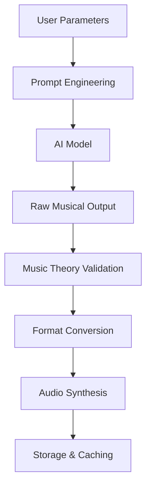

# Strategic Recommendations
# Jazz Piano Learning SaaS Platform

**Version**: 1.0  
**Date**: 2025-01-21  
**Product**: JazzMaster Pro  

## 1. Technical Feasibility Assessment

### 1.1 Overall Feasibility: ✅ HIGHLY FEASIBLE

The jazz piano learning SaaS application is **technically feasible** and well-suited to modern web technologies. Here's why:

**Strengths**:
- **Proven Technology Stack**: Next.js + NestJS is battle-tested for SaaS applications
- **AI Integration**: OpenAI API and music-specific AI models are readily available
- **Music Libraries**: Mature libraries like VexFlow and Tone.js handle notation and audio
- **Scalable Architecture**: Cloud-native design supports growth from day one

**Complexity Level**: **Medium-High** (manageable with proper planning)
- Music theory integration adds complexity but is well-documented
- AI content generation requires careful prompt engineering
- Audio synthesis is computationally intensive but achievable with modern browsers

### 1.2 Risk Mitigation Strategies

**Technical Risks**:
- **AI Quality**: Start with OpenAI API, develop custom models later
- **Audio Performance**: Use Web Audio API with fallbacks, implement caching
- **Music Theory Validation**: Partner with music theory experts, build validation rules

**Timeline Risks**:
- **MVP in 4 months** is achievable with focused scope
- **Full platform in 12 months** allows for iteration and refinement

## 2. AI Integration Architecture

### 2.1 Recommended AI Strategy

#### Phase 1: OpenAI Integration (MVP)
```typescript
// AI Service Architecture
interface AIProvider {
  generateJazzLick(params: LickParams): Promise<GeneratedContent>;
  generateChordProgression(params: ProgressionParams): Promise<GeneratedContent>;
  harmonizeMelody(melody: Melody): Promise<HarmonizedContent>;
}

class OpenAIProvider implements AIProvider {
  async generateJazzLick(params: LickParams) {
    const prompt = this.buildMusicPrompt(params);
    const response = await openai.chat.completions.create({
      model: "gpt-4",
      messages: [
        {
          role: "system",
          content: "You are a jazz piano expert. Generate musical content in ABC notation format."
        },
        {
          role: "user", 
          content: prompt
        }
      ]
    });
    
    return this.parseMusicalResponse(response);
  }
}
```

#### Phase 2: Custom Music Models (Advanced)
- **Magenta.js**: Google's music AI library for browser-based generation
- **Custom LSTM Models**: Train on jazz corpus for style-specific generation
- **Hybrid Approach**: Combine rule-based music theory with AI creativity

### 2.2 Content Generation Pipeline



**Key Components**:
1. **Prompt Engineering**: Convert user parameters to effective AI prompts
2. **Music Theory Validation**: Ensure generated content follows jazz harmony rules
3. **Format Conversion**: Convert AI output to standard notation (MusicXML, ABC)
4. **Quality Assessment**: Rate content difficulty and musical quality
5. **Caching Strategy**: Store frequently requested generations

### 2.3 AI Model Selection

| Model Type | Use Case | Pros | Cons | Recommendation |
|------------|----------|------|------|----------------|
| **OpenAI GPT-4** | Text-to-music prompts | Easy integration, good results | Cost, rate limits | ✅ MVP choice |
| **Magenta.js** | Browser-based generation | Real-time, offline capable | Limited jazz training | 🔄 Phase 2 |
| **Custom LSTM** | Style-specific generation | Tailored to jazz, full control | Development time, training data | 🔄 Phase 3 |

## 3. Music Notation & Audio Recommendations

### 3.1 Music Notation: VexFlow ✅ RECOMMENDED

**Why VexFlow**:
- **Mature Library**: 10+ years of development, stable API
- **Feature Complete**: Supports all standard notation elements
- **Customizable**: Extensive styling and interaction options
- **Performance**: Optimized for web rendering
- **Community**: Active development and support

**Implementation Strategy**:
```typescript
// VexFlow Integration
import { Renderer, Stave, StaveNote, Voice, Formatter } from 'vexflow';

class MusicNotationRenderer {
  renderScore(musicData: MusicData, container: HTMLElement) {
    const renderer = new Renderer(container, Renderer.Backends.SVG);
    const context = renderer.getContext();
    
    // Create stave and add notes
    const stave = new Stave(10, 40, 400);
    stave.addClef('treble').addTimeSignature('4/4');
    stave.setContext(context).draw();
    
    // Add notes and render
    const notes = this.convertToVexFlowNotes(musicData.notes);
    const voice = new Voice({ num_beats: 4, beat_value: 4 });
    voice.addTickables(notes);
    
    new Formatter().joinVoices([voice]).format([voice], 350);
    voice.draw(context, stave);
  }
}
```

**Alternative Considered**: OpenSheetMusicDisplay (more complex, heavier)

### 3.2 Audio System: Tone.js + Web Audio API ✅ RECOMMENDED

**Why Tone.js**:
- **Music-Focused**: Built specifically for musical applications
- **High-Quality Synthesis**: Professional-grade audio synthesis
- **Timing Precision**: Accurate musical timing and scheduling
- **Effects & Processing**: Built-in reverb, compression, EQ
- **Cross-Platform**: Works consistently across browsers

**Audio Architecture**:
```typescript
// Audio System Architecture
class AudioEngine {
  private synth: Tone.PolySynth;
  private transport: typeof Tone.Transport;
  
  constructor() {
    this.synth = new Tone.PolySynth(Tone.Synth).toDestination();
    this.transport = Tone.Transport;
  }
  
  async playMusicData(musicData: MusicData, tempo: number = 120) {
    this.transport.bpm.value = tempo;
    
    // Schedule notes
    musicData.notes.forEach(note => {
      this.transport.schedule((time) => {
        this.synth.triggerAttackRelease(
          note.pitch, 
          note.duration, 
          time
        );
      }, note.time);
    });
    
    this.transport.start();
  }
}
```

**Audio Features**:
- **Multiple Instruments**: Piano, bass, drums synthesis
- **Real-time Effects**: Reverb, compression for realistic sound
- **Tempo Control**: 50-200 BPM with smooth transitions
- **Loop Functionality**: Seamless looping for practice
- **Mobile Optimization**: Efficient audio processing for mobile devices

### 3.3 Audio Generation Strategy

#### Option 1: Real-time Synthesis (Recommended for MVP)
- **Pros**: No file storage, infinite variations, real-time parameter changes
- **Cons**: CPU intensive, requires good internet connection
- **Best For**: Interactive practice, parameter experimentation

#### Option 2: Pre-generated Audio Files
- **Pros**: Consistent quality, faster loading, offline capability
- **Cons**: Storage costs, limited variations
- **Best For**: High-quality playback, mobile optimization

#### Hybrid Approach (Recommended for Production)
- **Real-time synthesis** for user-generated content and experimentation
- **Pre-generated files** for popular content and mobile optimization
- **Progressive enhancement** based on device capabilities

## 4. SaaS Subscription Model Recommendations

### 4.1 Recommended Pricing Strategy

#### Free Tier (Lead Generation)
- **5 AI generations per day**
- **Basic content library access**
- **Standard audio playback**
- **Community features**
- **Goal**: Convert 20% to paid within 30 days

#### Pro Tier ($19.99/month) - Primary Revenue Driver
- **Unlimited AI generations**
- **Full content library access**
- **High-quality audio with multiple instruments**
- **Advanced practice tools and analytics**
- **Export capabilities (PDF, MIDI)**
- **Priority support**

#### Educator Tier ($39.99/month) - High-Value Segment
- **All Pro features**
- **Classroom management tools**
- **Student progress tracking**
- **Bulk content creation**
- **White-label options**
- **Dedicated support**

### 4.2 Implementation with Stripe

```typescript
// Subscription Service
@Injectable()
export class SubscriptionService {
  async createSubscription(userId: string, priceId: string) {
    const customer = await this.stripe.customers.create({
      metadata: { userId }
    });
    
    const subscription = await this.stripe.subscriptions.create({
      customer: customer.id,
      items: [{ price: priceId }],
      payment_behavior: 'default_incomplete',
      expand: ['latest_invoice.payment_intent'],
    });
    
    return subscription;
  }
  
  async handleWebhook(event: Stripe.Event) {
    switch (event.type) {
      case 'customer.subscription.updated':
        await this.updateUserSubscription(event.data.object);
        break;
      case 'invoice.payment_succeeded':
        await this.recordPayment(event.data.object);
        break;
    }
  }
}
```

### 4.3 Usage-Based Features

**Free Tier Limitations**:
- Daily generation limits tracked in Redis
- Feature gating based on subscription tier
- Usage analytics for conversion optimization

**Pro Tier Benefits**:
- Unlimited generations with quality prioritization
- Advanced features unlock
- Enhanced audio quality and options

## 5. Technology Stack Recommendations

### 5.1 Frontend Stack ✅ CONFIRMED
- **Framework**: Next.js 14+ (App Router, TypeScript)
- **Styling**: Tailwind CSS + shadcn/ui
- **State Management**: Zustand + TanStack Query
- **Audio**: Tone.js + Web Audio API
- **Notation**: VexFlow
- **Authentication**: Better Auth React client

### 5.2 Backend Stack ✅ CONFIRMED
- **Framework**: NestJS (TypeScript)
- **Database**: PostgreSQL + Prisma
- **Authentication**: Better Auth
- **AI Integration**: OpenAI API
- **File Storage**: AWS S3 / Cloudinary
- **Caching**: Redis
- **Queue**: Bull/BullMQ

### 5.3 Infrastructure Recommendations
- **Frontend Hosting**: Vercel (optimal for Next.js)
- **Backend Hosting**: Railway / Render (NestJS-friendly)
- **Database**: Supabase / Neon (managed PostgreSQL)
- **CDN**: Cloudflare (global audio delivery)
- **Monitoring**: Sentry + DataDog
- **Analytics**: PostHog (privacy-focused)

## 6. Development Recommendations

### 6.1 Team Structure (Recommended)
- **1 Full-stack Developer** (Next.js + NestJS expertise)
- **1 Frontend Specialist** (Audio/Music UI focus)
- **1 Backend Developer** (AI integration + APIs)
- **1 Music Theory Consultant** (Part-time)
- **1 Product Manager/Designer**

### 6.2 Development Approach
1. **Start with MVP** (4 months): Core features, basic AI
2. **Iterate based on user feedback** (continuous)
3. **Add advanced features** (months 5-12)
4. **Scale and optimize** (ongoing)

### 6.3 Success Metrics
- **Technical**: 99.9% uptime, <200ms API response, <3s page load
- **Business**: 20% free-to-paid conversion, 70% monthly retention
- **User**: 4.5+ star rating, 20+ min average session

## 7. Next Steps & Immediate Actions

### Week 1-2: Foundation
1. **Set up development environment** following our established guidelines
2. **Create project repositories** (frontend/backend)
3. **Implement basic authentication** with Better Auth
4. **Set up CI/CD pipeline** with testing and deployment

### Week 3-4: Core Infrastructure
1. **Database schema implementation** using Prisma
2. **Basic API structure** with NestJS
3. **Frontend project setup** with Next.js
4. **Music notation proof-of-concept** with VexFlow

### Month 2: MVP Development
1. **AI integration** with OpenAI API
2. **Music notation rendering** system
3. **Audio playback** implementation
4. **User management** and subscriptions

This strategic approach balances technical feasibility with business viability, providing a clear path to launch and scale your jazz piano learning platform. The recommended technology stack aligns perfectly with your established guidelines and provides the foundation for a successful SaaS application.

---

**Document Owner**: Technical Strategy Lead  
**Last Updated**: 2025-01-21  
**Next Review**: 2025-02-21
